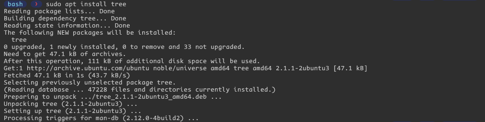

# Linux Fundamentals Command Guide

## File System Navigation

1. **`ls ~/`**
   - **Description**: Lists the contents of the home directory.
   - **Example**:
     ```bash
     ls ~/
     ```
        

2. **`cd /var/log && ls`**
   - **Description**: Changes the current directory to `/var/log` and lists its contents.
   - **Example**:
     ```bash
     cd /var/log && ls
     ```
        

3. **`which bash`**
   - **Description**: Finds and displays the path to the bash executable.
   - **Example**:
     ```bash
     which bash
     ```
        

4. **`echo $SHELL`**
   - **Description**: Displays the current shell being used.
   - **Example**:
     ```bash
     echo $SHELL
     ```
        

## File and Directory Operations

1. **`mkdir ~/linux_fundamentals`**
   - **Description**: Creates a directory named `linux_fundamentals` in your home directory.
   - **Example**:
     ```bash
     mkdir ~/linux_fundamentals
     ```
        

2. **`mkdir ~/linux_fundamentals/scripts`**
   - **Description**: Creates a subdirectory named `scripts` inside `linux_fundamentals`.
   - **Example**:
     ```bash
     mkdir ~/linux_fundamentals/scripts
     ```
        

3. **`touch ~/linux_fundamentals/example.txt`**
   - **Description**: Creates an empty file named `example.txt` inside the `linux_fundamentals` directory.
   - **Example**:
     ```bash
     touch ~/linux_fundamentals/example.txt
     ```
        

4. **`cp ~/linux_fundamentals/example.txt ~/linux_fundamentals/scripts/`**
   - **Description**: Copies `example.txt` to the `scripts` directory.
   - **Example**:
     ```bash
     cp ~/linux_fundamentals/example.txt ~/linux_fundamentals/scripts/
     ```
        

5. **`mkdir ~/linux_fundamentals/backup && mv ~/linux_fundamentals/example.txt ~/linux_fundamentals/backup/`**
   - **Description**: Moves `example.txt` from `linux_fundamentals` to `linux_fundamentals/backup`.
   - **Example**:
     ```bash
     mkdir ~/linux_fundamentals/backup && mv ~/linux_fundamentals/example.txt ~/linux_fundamentals/backup/
     ```
        

6. **`chmod 644 ~/linux_fundamentals/backup/example.txt`**
   - **Description**: Changes the permissions of `example.txt` to read and write for the owner, and read-only for the group and others.
   - **Example**:
     ```bash
     chmod 644 ~/linux_fundamentals/backup/example.txt
     ```
        

7. **`ls -l ~/linux_fundamentals/backup/example.txt`**
   - **Description**: Verifies the permission changes.
   - **Example**:
     ```bash
     ls -l ~/linux_fundamentals/backup/example.txt
     ```
        

## File Modification

1. **`touch ~/example.txt`**
   - **Description**: Creates a file named `example.txt` in your home directory.
   - **Example**:
     ```bash
     touch ~/example.txt
     ```
        

2. **`sudo chown student ~/example.txt`**
   - **Description**: Changes the owner of `example.txt` to a user named `student`.
   - **Example**:
     ```bash
     sudo chown student ~/example.txt
     ```
        

3. **`sudo chgrp students ~/example.txt`**
   - **Description**: Changes the group of `example.txt` to a group named `students`.
   - **Example**:
     ```bash
     sudo chgrp students ~/example.txt
     ```
        

4. **`ls -l ~/example.txt`**
   - **Description**: Verifies the changes using appropriate commands.
   - **Example**:
     ```bash
     ls -l ~/example.txt
     ```
        

## Ownership

1. **`mkdir ~/project`**
   - **Description**: Creates a directory named `project` in your home directory.
   - **Example**:
     ```bash
     mkdir ~/project
     ```
        

2. **`touch ~/project/report.txt`**
   - **Description**: Creates a file named `report.txt` inside the `project` directory.
   - **Example**:
     ```bash
     touch ~/project/report.txt
     ```
        

3. **`chmod 644 ~/project/report.txt`**
   - **Description**: Sets the permissions of `report.txt` to read and write for the owner, and read-only for the group and others.
   - **Example**:
     ```bash
     chmod 644 ~/project/report.txt
     ```
        

4. **`chmod 755 ~/project`**
   - **Description**: Sets the permissions of the `project` directory to read, write, and execute for the owner, and read and execute for the group and others.
   - **Example**:
     ```bash
     chmod 755 ~/project
     ```
        

5. **`ls -l ~/project`**
   - **Description**: Verifies the changes using appropriate commands.
   - **Example**:
     ```bash
     ls -l ~/project
     ```
        

## User Add/Modify

1. **`sudo useradd -m developer`**
   - **Description**: Creates a new user named `developer` with a home directory and shell.
   - **Example**:
     ```bash
     sudo useradd -m developer
     ```
        

2. **`sudo useradd -m -d /home/developer_home developer`**
   - **Description**: Set the home derectory of user `developer` to `developer_home`.
   - **Example**:
     ```bash
     sudo usermod -m -d /home/developer_home developer
     ```
        

3. **`sudo usermod -s /bin/bash developer`**
   - **Description**: Changes the shell of the user `developer` to `bash` from  `sh`.
   - **Example**:
     ```bash
     sudo usermod -s /bin/bash developer
     ```
        

4. **`grep developer /etc/passwd`**
   - **Description**: Verify details of user `developer`.
   - **Example**:
     ```bash
     grep developer /etc/passwd
     ```
        

5. **`sudo usermod -l devuser developer`**
   - **Description**: Change the username `developer` to `devuser`.
   - **Example**:
     ```bash
     sudo usermod -l devuser developer
     ```
        

6. **`sudo usermod -aG devgroup devuser`**
   - **Description**: Adds `devuser` to a group named `devgroup`.
   - **Example**:
     ```bash
     sudo usermod -aG devgroup devuser
     ```
        

7. **`sudo passwd devuser`**
   - **Description**: Sets the password of `devuser` to `devpass`.
   - **Example**:
     ```bash
     sudo passwd devuser
     ```
        

## Hard/Soft Link

1. **`touch ~/original.txt`**
   - **Description**: Creates a file named `original.txt` in the home directory.
   - **Example**:
     ```bash
     touch original.txt
     ```
        

2. **`ln -s ~/original.txt ~/softlink.txt`**
   - **Description**: Creates a symbolic link named `softlink.txt` pointing to `original.txt`.
   - **Example**:
     ```bash
     ln -s ~/original.txt ~/softlink.txt
     ```
        

3. **`rm ~/original.txt && ls`**
   - **Description**: Removes the original.txt file and `ls` shows the link is broken.
   - **Example**:
     ```bash
     rm ~/original.txt && ls
     ```
        

4. **`ln ~/datafile.txt ~/hardlink.txt`**
   - **Description**: Creates a hard link named `hardlink.txt` pointing to `datafile.txt`.
   - **Example**:
     ```bash
     ln ~/datafile.txt ~/hardlink.txt
     ```
        

3. **`find ~ -name "*.txt"`**
   - **Description**: Finds all `.txt` files in your home directory.
   - **Example**:
     ```bash
     find ~ -name "*.txt"
     ```
        

## Package Installation

1. **`sudo apt update`**
   - **Description**: Updates the repository cache using `apt`.
   - **Example**:
     ```bash
     sudo apt update
     ```
        

2. **`sudo apt install tree`**
   - **Description**: Installs a package named `tree`.
   - **Example**:
     ```bash
     sudo apt install tree
     ```
        

3. **`google-cloud-cli`**
   - **Description**: Installs the Google Cloud CLI tool using `apt` with all the prerequisite.
   - **Example**:
     ```bash
     sudo apt upadte && \
     sudo apt install -y apt-transport-https ca-certificates gnupg curl && \
     curl https://packages.cloud.google.com/apt/doc/apt-key.gpg | sudo gpg --dearmor -o /usr/share/keyrings/cloud.google.gpg && \
     echo "deb [signed-by=/usr/share/keyrings/cloud.google.gpg] https://packages.cloud.google.com/apt cloud-sdk main" | sudo tee -a /etc/apt/sources.list.d/google-cloud-sdk.list && \
     sudo apt update && \
     sudo apt install -y google-cloud-cli
     ```
        

